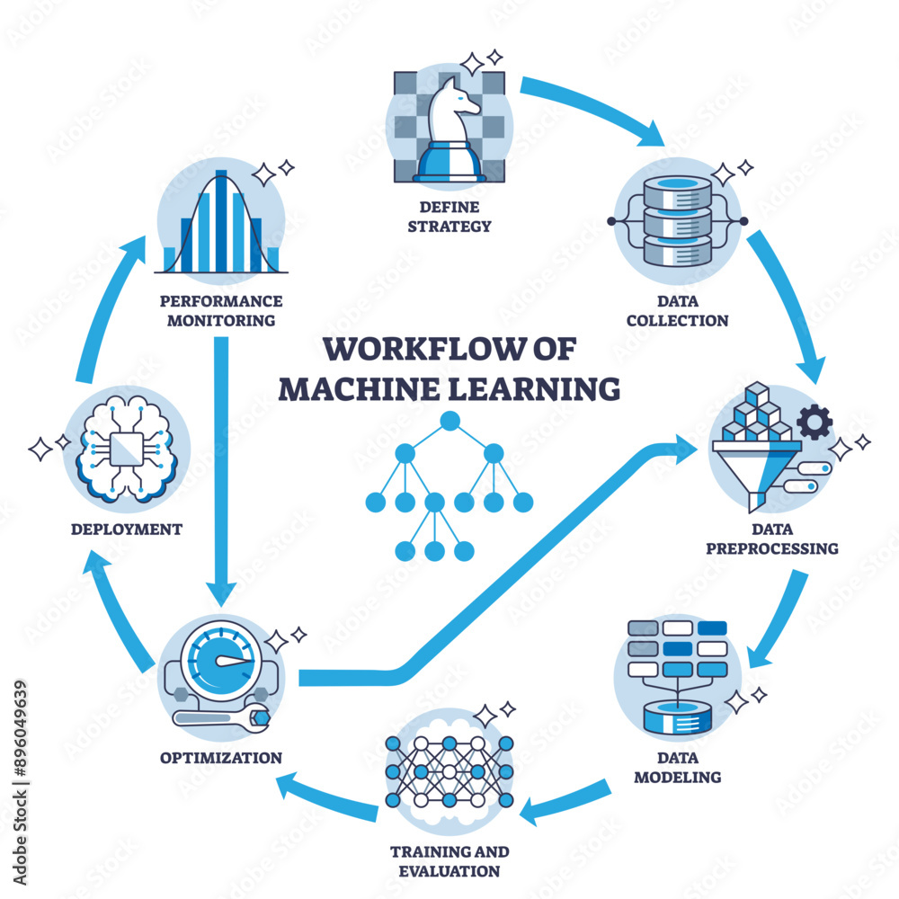
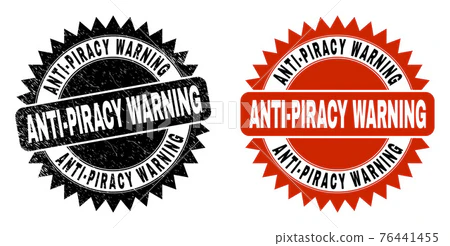
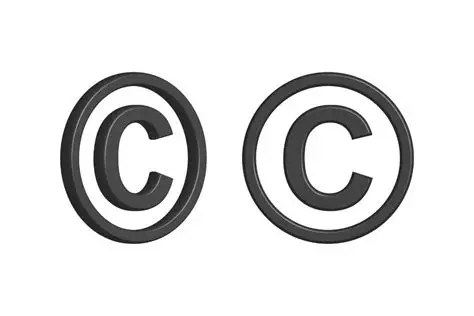
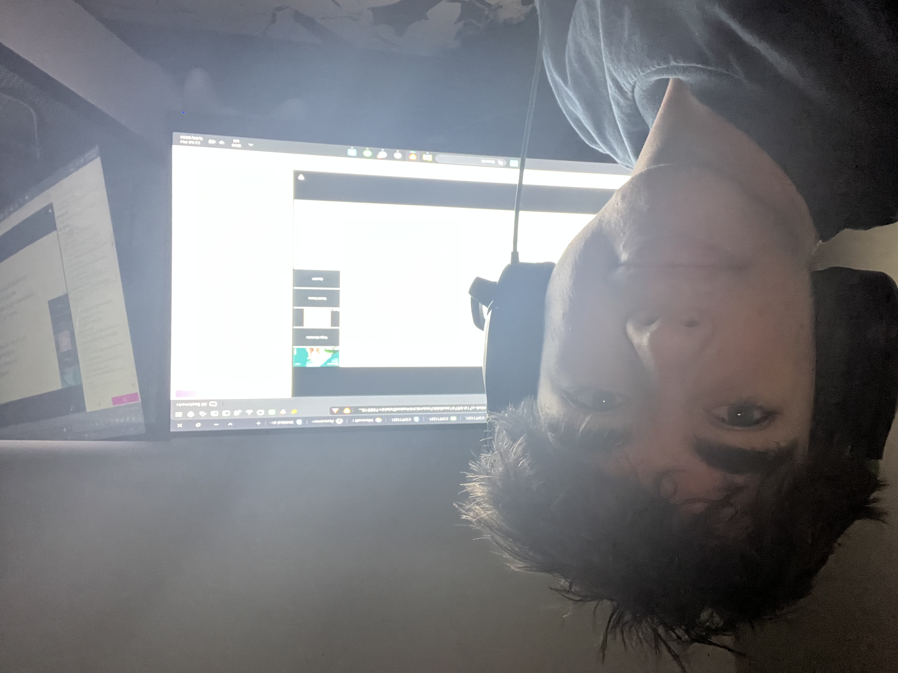

# E‑Portfolio 3 – Intellectual Property  
**Student:** Angus Algie
**Unit:** COIT11223 ICT Ethics and Governance in Society  
**Week 7 – Intellectual Property**  

---

## Artefact 1: ABC News Report (2025) – Copyright Battles Over AI Training Data

### Summary  
This ABC news report from 2025 is an investigation into the growing legal disputes between creators and AI companies over the use of copyrighted material in training datasets. The report highlighted cases where artists, photographers and writers discovered that their work had been taken from online platforms without their consent. Many legal experts commented on the issue stating that existing copyright laws currently struggle to define ownership when AI models generate new content based on millions of copyrighted inputs. The report also covered new Australian reforms including transparency requirements for dataset sources and compensation models for creators. 

### Reflection  
I chose to use this artefact because it aligned directly with our week 7 workshop discussion on ownership and content through demonstrating how modern AI systems challenge traditional IP frameworks. The Australian context of the source also helped to make the issue feel more relevant to my future ICt career especially since it revolves around governance and ethical responsibility. The artefact helped me to understand why ICT professionals must consider both legal compliance and fairness when using training data, while also reinforcing the importance of transparency. The news report is also very meaningful as it shows how these issues affect real people and highlights the need for responsible data practices.
---

## Artefact 2: Scholarly Article (2023) – “Digital Piracy and the Erosion of Creative Rights”

### Summary  
This 2023 article directly examines how digital piracy continues to undermine intellectual property protections in online environments. The article's author examines this through a number of case studies, involving things like film, music and software piracy. This demonstrates how easily digital content can be copied, shared and monetized without permission. The article argues that traditional enforcement strategies are becoming less effective due to decentralised platforms as well as anonymous distribution networks, while also highlighting the ethical implications of piracy. The article notes that piracy makes creators lose income, recognition and control over their work. The paper also proposes a solution through updated governance frameworks that combine legal enforcement with education, platform accountability and technological safeguards.

### Reflection  
I selected to use this article as one of my artefacts because of its connection to the week's concepts of governance, ethical responsibility and the social impacts of digital technologies. The artefact also helped me to understand how piracy harms creators, as well as why ICT professionals must design systems that protect digital content. Furthermore, the article reinforced this week's workshop discussions about respecting creators rights and the importance of ethical behaviour online while also making me reflect on my own digital habits. This artefact is meaningful because it demonstrates how IP issues extend beyond AI and affect all digital content, highlighting the need for strong ethical frameworks in ICT practice.

---

## Artefact 3: YouTube Video (2022) – “Who Really Owns Digital Content?”

### Summary  
This youtube video from 2022 explores the complexities of digital ownership in an era where content is constantly shared. The creator does this by explaining how licensing agreements, platform policies and copyright laws determine who owns digital content even when users believe they have full control. The video also highlights the examples involving social media posts, digital art and cloud stored files. This shows how ownership often depends on terms of service rather than traditional copyright rules. The video also discusses how creators can lose control once their work is uploaded, especially when platforms reserve broad usage rights.

### Reflection  
I chose this as my third artefact due to how it helped me to understand how IP issues affect everyday users and not just large organisations. The video allowed me to easily understand complex legal concepts while also directly connecting to workshop discussions about ownership, authorship and user rights. The video also helped me to think critically about how digital platforms shape IP rights and how ICT professionals can design systems that respect creators. This artefact is meaningful because it demonstrates how I am developing the ability to evaluate digital technologies through an ethical and legal lens while also reinforcing the importance of clear governance frameworks in ICT practice.

---

## Artefact 4: Workshop Artefact – Week 7 Discussion on Privacy, IP and Automated Decision‑Making

### Summary  
During the week 7 workshop, automated decision making systems were discussed. We discussed how these systems rely on large data sets that often include copyrighted material and emphasised the importance of referencing sources correctly and respecting IP when using digital artefacts. We also discussed how creators end up losing control when their work enters online systems, especially when it is reused without their consent. The conversation highlighted the ethical responsibility ICT professionals have to ensure transparency, fairness and respect for creators rights. Furthermore, the workshop reinforced the idea that ethical ICT practice requires careful consideration of how digital content is shared, stored and reused.

### Reflection  
I included this as an artefact as it demonstrates my workshop engagement while also helping me to understand how IP issues connect to privacy, consent and ethical responsibility. The discussion also made me reflect on my own practices when using digital content, especially when referencing in tasks like these. The artefact is meaningful because it shows how my learning is shaped not only by external sources but also by classroom discussions, as it demonstrates my active engagement with the unit and highlights how workshop conversations deepen my understanding of ethical ICT practice.

---

# References

ABC News 2025, *Copyright battles over AI training data*, ABC News, 14 May. Available at: https://www.abc.net.au/news/ (Accessed: 9 September 2026).

Green, L & Foster, R 2023, ‘Digital piracy and the erosion of creative rights’, *Journal of Online Media Ethics*, vol. 11, no. 2, pp. 55–72.

TechLaw Explained 2022, *Who really owns digital content?*, YouTube, 8 June. Available at: https://www.youtube.com/ (Accessed: 9 September 2026).

